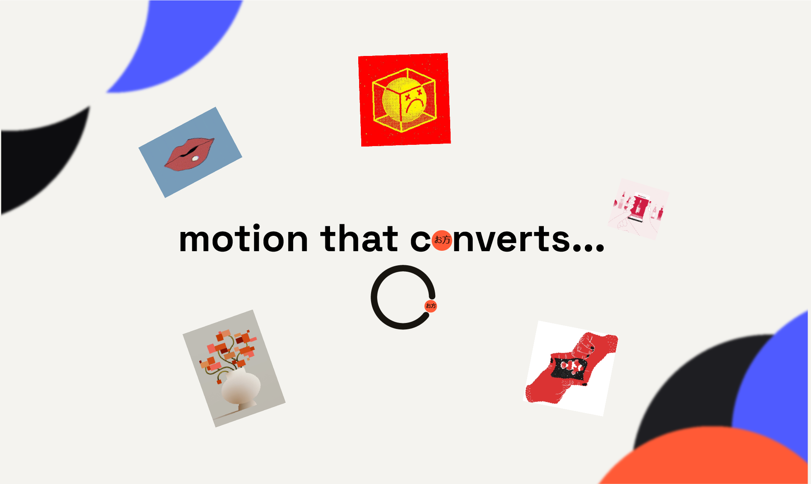

<div align="center">



# Okata Miracle — Portfolio

**One person, two crafts.** A dual-mode portfolio — `/build` for frontend development work, `/animate` for motion design work — backed by a self-built admin CMS.

[](https://www.okata-miracle.site)
[](https://nextjs.org)
[](https://www.typescriptlang.org)
[](https://tailwindcss.com)
[](./LICENSE)

</div>

---

## Contents

- [What this is](#what-this-is)
- [Features](#features)
- [Tech stack](#tech-stack)
- [Project structure](#project-structure)
- [Getting started](#getting-started)
- [Available scripts](#available-scripts)
- [Database migrations](#database-migrations)
- [License](#license)

---

## What this is

This repo powers **[okata-miracle.site](https://www.okata-miracle.site)**, a portfolio site with two distinct front doors sharing one codebase and one database:

| Route | Audience | Focus |
| :--- | :--- | :--- |
| **`/build`** | Engineering-minded visitors | Frontend dev projects, experience, testimonials |
| **`/animate`** | Motion/brand-minded visitors | Motion design reels, process breakdowns, storyboards |

Both routes are driven by content that lives in a real database and is managed through a private `/admin` CMS — nothing on the public site is hardcoded.

<details>
<summary><strong>Why one codebase, two routes?</strong></summary>
<br>

Okata does both frontend development and motion design professionally. Rather than run two separate sites, `/build` and `/animate` share the design system, data layer, and admin tooling, but each gets its own visual identity (accent color, typography accents, nav, copy) so neither feels like an afterthought bolted onto the other.

</details>

---

## Features

- **Dual portfolio modes** — `/build` and `/animate`, switchable from either nav, each with its own accent theme and content types
- **Custom admin CMS** (`/admin`) — full CRUD for dev projects, motion projects, resources, testimonials, blog posts, experience entries, and site stats; drag-to-reorder lists; bulk image upload for storyboards
- **Custom YouTube player** — native player chrome fully replaced with a minimal play/pause + scrubber UI (no channel branding, no suggested videos) via the YouTube IFrame API
- **Lightbox gallery** — swipeable/scrollable full-screen image viewer for project storyboards
- **Motion throughout** — GSAP scroll-triggered reveals, Framer Motion micro-interactions, Lenis smooth scroll
- **Session-based auth** — single-admin login via signed cookies (`iron-session`), no third-party auth provider
- **Image uploads via Vercel Blob**, served through Next.js Image Optimization
- **Contact form** with email delivery via Nodemailer
- **SEO-ready** — sitemap generation, Open Graph metadata, per-route canonical URLs

---

## Tech stack

| Layer | Choice |
| :--- | :--- |
| Framework | [Next.js 15](https://nextjs.org) (App Router, Turbopack) + React 19 |
| Language | TypeScript |
| Styling | Tailwind CSS v4 |
| Database | [Turso](https://turso.tech) (libSQL) via [Drizzle ORM](https://orm.drizzle.team) |
| File storage | [Vercel Blob](https://vercel.com/docs/storage/vercel-blob) |
| Auth | [iron-session](https://github.com/vvo/iron-session) (signed-cookie sessions) |
| Animation | GSAP, Motion (Framer Motion), Lenis |
| Validation | Zod |
| Email | Nodemailer |
| Testing | Vitest, Testing Library |
| Deployment | Vercel |

---

## Project structure

<details>
<summary><strong>Expand directory overview</strong></summary>
<br>

```
app/
├── build/              # /build route — dev portfolio
├── animate/            # /animate route — motion portfolio
├── admin/              # Private CMS — auth-gated, full content CRUD
└── api/                # Route handlers (contact form, uploads, webhooks)

components/
├── Home/                # Shared building blocks + /build-specific UI
├── Animate/              # /animate-specific UI (nav, hero, gallery, player)
├── Admin/                # CMS forms, lists, upload widgets
└── Shared/               # Cross-route components (project cards, expandable text)

lib/
├── db/                  # Drizzle schema + client
├── actions/              # Server actions — the only way routes touch the DB
├── auth/                 # Session handling
└── data/                 # Public read-only data fetchers

drizzle/                 # Generated SQL migrations
```

</details>

---

## Getting started

### Prerequisites

- Node.js 20+
- A [Turso](https://turso.tech) database
- A [Vercel Blob](https://vercel.com/docs/storage/vercel-blob) store (for image uploads)

### Setup

```bash
# 1. Clone
git clone https://github.com/OkataMiracleDev/my_portfolio.git
cd my_portfolio

# 2. Install
npm install

# 3. Configure environment
cp .env.example .env.local
# then fill in .env.local — see below for what each variable is for

# 4. Apply database migrations
npx drizzle-kit migrate

# 5. Run
npm run dev
```

Open [http://localhost:3000](http://localhost:3000). The admin CMS lives at `/admin/login`.

<details>
<summary><strong>Environment variables</strong> (see <code>.env.example</code>)</summary>
<br>

| Variable | Used for |
| :--- | :--- |
| `TURSO_DATABASE_URL`, `TURSO_AUTH_TOKEN` | Database connection |
| `BLOB_READ_WRITE_TOKEN`, `BLOB_STORE_ID`, `BLOB_WEBHOOK_PUBLIC_KEY` | Image/file uploads |
| `ADMIN_PASSWORD_HASH`, `SESSION_SECRET` | Admin login + session signing |
| `EMAIL_USER`, `EMAIL_PASS` | Contact form delivery |

</details>

---

## Available scripts

| Command | Description |
| :--- | :--- |
| `npm run dev` | Start the dev server (Turbopack) |
| `npm run build` | Production build |
| `npm run start` | Serve the production build |
| `npm run lint` | Run ESLint |
| `npm run test` | Run the test suite once |
| `npm run test:watch` | Run tests in watch mode |

---

## Database migrations

Schema lives in `lib/db/schema.ts`. After changing it:

```bash
npx drizzle-kit generate   # writes a new SQL file to drizzle/
npx drizzle-kit migrate    # applies pending migrations to TURSO_DATABASE_URL
```

Generated migrations are committed — review the SQL in `drizzle/` before applying anything against a database with real data.

---

## License

All Rights Reserved — see [`LICENSE`](./LICENSE). This repository is public for portfolio and demonstration purposes; it is not open source.

---

<div align="center">

Built by **[Okata Miracle](https://www.okata-miracle.site)**

</div>
